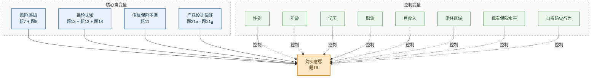

# 洪涝灾害保险购买意愿影响模型图（精致流程图版）

```mermaid
flowchart TB
    classDef core fill:#E8F1FB,stroke:#2F6EA6,stroke-width:1.8px,color:#16324A;
    classDef outcome fill:#FBE7C6,stroke:#C97A1E,stroke-width:2.2px,color:#4A2A00;
    classDef control fill:#EAF6EA,stroke:#4E8B57,stroke-width:1.4px,color:#1F4A28;
    classDef group fill:#FAFAFA,stroke:#999,stroke-dasharray: 5 5,color:#333;

    subgraph A["核心自变量"]
        direction TB
        X1["风险感知<br/>题7 + 题8"]
        X2["保险认知<br/>题12 + 题13 + 题14"]
        X3["传统保险不满<br/>题11"]
        X4["产品设计偏好<br/>题21a - 题21g"]
    end

    Y["购买意愿<br/>题16"]

    subgraph C["控制变量"]
        direction LR
        C1["性别"]
        C2["年龄"]
        C3["学历"]
        C4["职业"]
        C5["月收入"]
        C6["常住区域"]
        C7["现有保障水平"]
        C8["自费防灾行为"]
    end

    X1 --> Y
    X2 --> Y
    X3 --> Y
    X4 --> Y

    C1 -.控制.-> Y
    C2 -.控制.-> Y
    C3 -.控制.-> Y
    C4 -.控制.-> Y
    C5 -.控制.-> Y
    C6 -.控制.-> Y
    C7 -.控制.-> Y
    C8 -.控制.-> Y

    class X1,X2,X3,X4 core;
    class Y outcome;
    class C1,C2,C3,C4,C5,C6,C7,C8 control;
    class A,C group;
```

## 图下注释

图X 洪涝灾害保险购买意愿影响模型图

说明：本研究以购买意愿为因变量，以风险感知、保险认知、传统保险不满和产品设计偏好为核心自变量，并将性别、年龄、学历、职业、月收入、常住区域、现有保障水平和自费防灾行为纳入回归模型作为控制变量。
