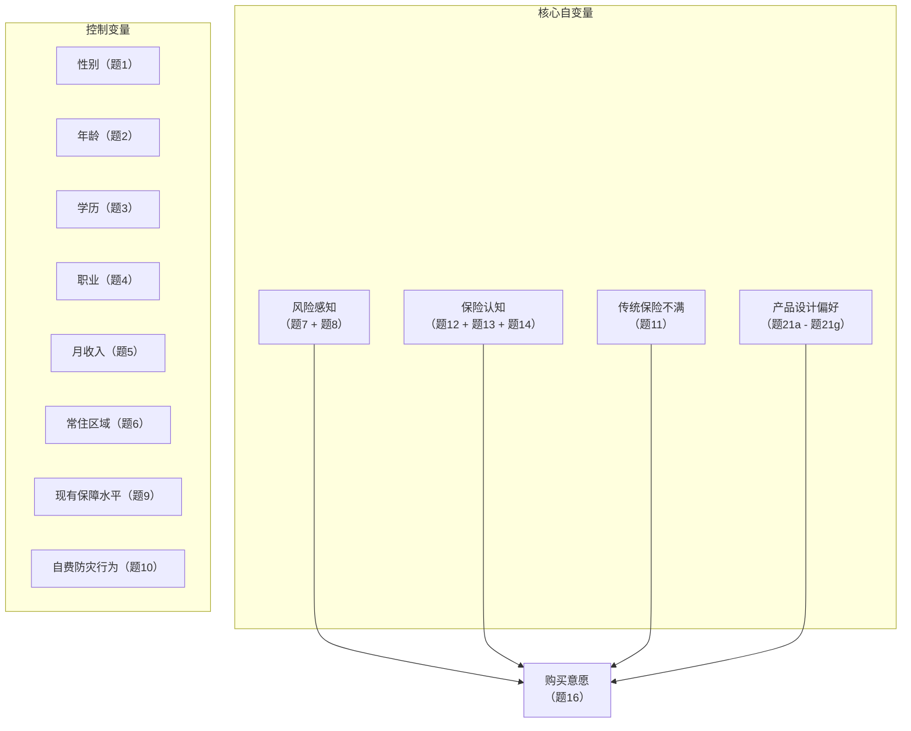

# 洪涝灾害保险购买意愿影响模型图

## 简化版文字结构

核心自变量：

- 风险感知
- 保险认知
- 传统保险不满
- 产品设计偏好

因变量：

- 购买意愿

控制变量：

- 性别
- 年龄
- 学历
- 职业
- 月收入
- 常住区域
- 现有保障水平
- 自费防灾行为

## 论文中可直接配套使用的图注

图X 洪涝灾害保险购买意愿影响模型图

说明：本研究以购买意愿为因变量，以风险感知、保险认知、传统保险不满和产品设计偏好为核心自变量，并将性别、年龄、学历、职业、月收入、常住区域、现有保障水平和自费防灾行为作为控制变量纳入后续回归模型进行检验。
